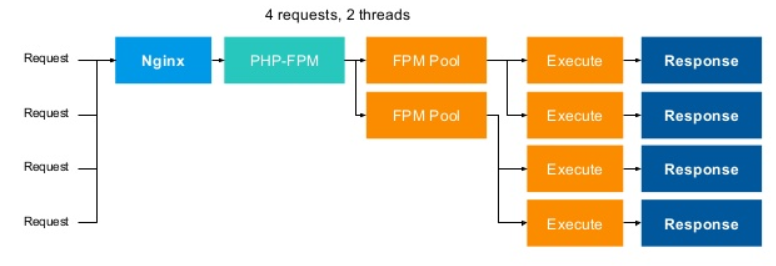
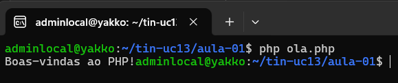
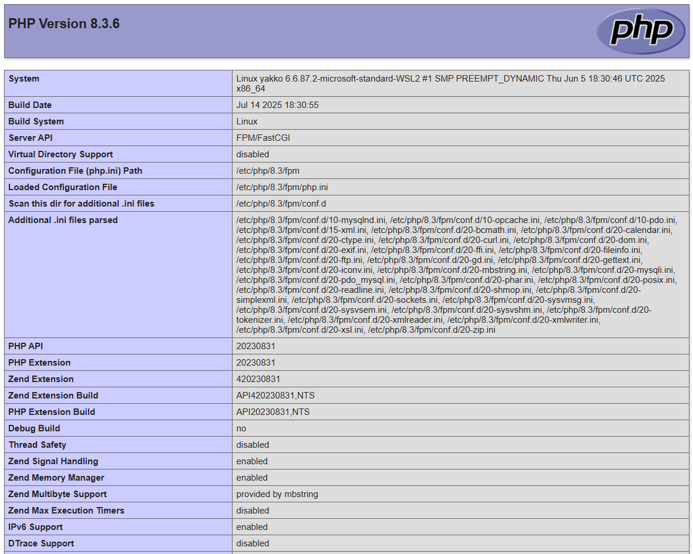

# 🌍 - Preparando o ambiente

## 🎯 - Objetivos
- O que precisamos para desenvolver com PHP
- Preparar o ambiente para as aulas

## 🖥️ - Preparando PC
> Precisamos instalar Linux Ubuntu em WSL no computador. Para isto precisamos acessar a loja de aplicativos da Microsoft. Para isto clique em `Iniciar` do Windows e procure por *Microsoft Store*. Ao abrir a loja, na janela de pesquisa digite *Ubuntu*, selecione **Ubuntu 24.04** e depois clique no botão **Instalar**.

## 📦 - Instalando os pacotes necessários
### 1) Instalando PHP8
```bash
sudo apt install php8.3 php8.3-fpm php8.3-mysql php8.3-xml php8.3-curl php8.3-mbstring php8.3-zip php8.3-bcmath php8.3-gd -y
```

> O que são os plugins do PHP que instalamos:
- mysql – Para interagir com bancos de dados MySQL
- zip – Útil ao trabalhar com arquivos compactados
- gd – Você precisa dele para trabalhar com imagens
- mbstring – Gerenciamento de strings não ASCII
- curl – Para fazer solicitações HTTP em PHP
- xml – Trabalhando com dados XML
- bcmath – Trabalhando com flutuadores de precisão

### 2) Configurar FPM (*FastCGI Process Manager*)
> Vamos precisar editar o arquivo de configuração, para isto execute o comando abaixo:
```bash
sudo nano /etc/php/8.3/fpm/php.ini
```
> Vamos editar os seguintes parâmetros:

- **memory_limit**: ajuste para 512M
- **max_execution_time**: vamos configurar para 60
- **opcache.enable**: verificar se está ativado, valor deve ser 1
- **opcache.memory_consumption**: vamos colocar 128

> Agora precisamos reiniciar o serviço:
```bash
sudo systemctl restart php8.3-fpm.service
```

#### 🛠️ - Como funciona
> Vamos entender um pouco de como as coisas funcionam. O PHP rodando em FastCGI, funciona a parte do servidor web, possibilitando assim que possamos escalar os processos do PHP se necessário, criando cluster ou conteiners. Documentação Oficial do [FPM](https://www.php.net/manual/pt_BR/install.fpm.php).



> PHP possui também para alguns servidores web a possibilidade de trabalhar como módulo, ficando "mais integrado" ao servidor, entretanto ficando "limitado" aos recursos e velocidade do web server.

#### 🚀 - Testando nossa instalaçao
> Para testar nosso processo até o momento podemos fazer dois testes bem simples:
- Executar na console do nosso WSL o comando
```bash
php -v
```
> A saída do comando deve indicar qual a versão do PHP que está em execução, algo conforme abaixo:
```bash
PHP 8.3.6 (cli) (built: Jul 14 2025 18:30:55) (NTS)
Copyright (c) The PHP Group
Zend Engine v4.3.6, Copyright (c) Zend Technologies
    with Zend OPcache v8.3.6, Copyright (c), by Zend Technologies
```
> Outra forma que podemos testar e criar e executar um script PHP, observe abaixo:
- Vamos executar o comando abaixo para criar um arquivo chamado ola.php com o conteúdo listado:
```bash
tee ola.php<<EOF
<?php
  echo "Bem-vindo ao PHP!";
>>
EOF
```
- Executar com a seguinte chamada:
```bash
php ola.php;echo
```
- O resultado deve ser a "impressão" na tela da mensagem *Bem-vindo ao PHP!*, conforme abaixo:


### 3) Instalar o web server NGINX
> Como vamos trabalhar com desenvolvimento voltado a internet, precisamos implementar um servidor de conteúdo web, para isto vamos usar o **NGINX**, existem outros servidores web que o PHP pode ser integrado, como **IIS** da Microsoft, **Apache** tanto para Linux quanto Windows, entre outros.
```bash
sudo apt install nginx -y
```
> Após instalar o nosso web server, precisamos configurar para que possa interagir com nosso PHP, para isto vamos usar o NANO como editor de textos para alterar o arquivo de configuração do NGINX:
```bash
sudo nano /etc/nginx/sites-available/default
```

> Vamos apagar todo o conteúdo do arquivo, podemos fazer isto usando o comando `CRTL+k`. Após isto podemos colar o conteúdo abaixo:
```bash
# Default server configuration
#
server {
        listen 80 default_server;
        listen [::]:80 default_server;

        root /var/www/html;

        # Add index.php to the list if you are using PHP
        index index.php index.html;

        server_name _;

        location / {
                # First attempt to serve request as file, then
                # as directory, then fall back to displaying a 404.
                try_files $uri $uri/ =404;
        }

        # pass PHP scripts to FastCGI server
        #
        location ~ \.php$ {
                include snippets/fastcgi-php.conf;

        #       # With php-fpm (or other unix sockets):
                fastcgi_pass unix:/run/php/php8.3-fpm.sock;
        #       # With php-cgi (or other tcp sockets):
        #       fastcgi_pass 127.0.0.1:9000;
                fastcgi_param   SCRIPT_FILENAME    $document_root$fastcgi_script_name;
                fastcgi_param   SCRIPT_NAME        $fastcgi_script_name;
                include fastcgi_params;
        }

        # deny access to .htaccess files, if Apache's document root
        # concurs with nginx's one
        #
        location ~ /\.ht {
                deny all;
        }
}
```

> Agora precisamos reiniciar o **NGINX** para que possamos desfrutar das novas configurações:
```bash
sudo systemctl restart nginx
```

> Vamos testar de tudo Ok?
```bash
cd /var/www/html
sudo tee index.php<<EOF
<?php
  phpinfo();
?>
EOF
```

> Vamos abrir um navegador e digitar na URI o seguinte `http://localhost`. Isto deve nos mostrar uma página com a versão do PHP e seus parâmetros de configuração. Semelhante abaixo:



### 4) Instalando SGBD MySQL
> Para que possamos armazenar dados de forma persistente para nossa aplicação, vamos usar o MySQL como SGBD, para que possamos então instalar o MySQL no nosso servidor, vamos executar o comando abaixo:
```bash
sudo apt install mysql-server -y
```

> Com isto, finalizamos o processo de preparar nosso ambiente. Para desenvolver em PHP podemos usar várias IDE´s, vamos trabalhar nesta disciplina com o Visual Studio Code, que já está instalado no computador.