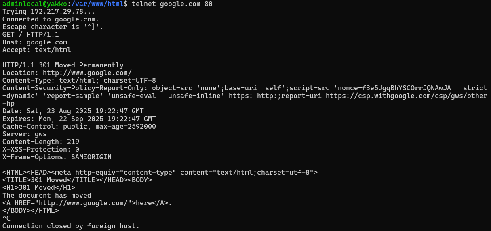
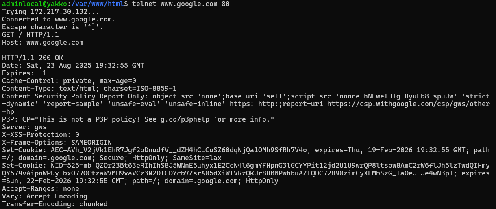

# 🌐 Aula 2 — Fundamentos da Web

> Arquitetura Cliente-Servidor • Front-end e Back-end • Sites Estáticos e Dinâmicos

---
## 🎯 - Objetivos
- Entender o funcionamento básico da Web
- Compreender o modelo cliente-servidor
- Identificar as camadas de uma aplicação web
- Diferenciar sites estáticos de dinâmicos
- Contextualizar as linguagens e tecnologias utilizadas

---
## 🧩 - O que é a Web?

A Web é um sistema distribuído de documentos e aplicações interconectadas, acessadas por navegadores através de protocolos como HTTP.

### Componentes principais:
- **Navegador** (Chrome, Firefox, Edge)
- **Servidores Web** (Apache, Nginx)
- **HTTP/HTTPS** — protocolos de comunicação
- **URLs** — endereços dos recursos
- **DNS** — traduz nomes em IPs

---
## 🖥️ - Cliente vs Servidor

| Aspecto         | Cliente                      | Servidor                        |
|-----------------|------------------------------|----------------------------------|
| Localização     | Navegador do usuário         | Máquina remota (host)           |
| Função          | Solicita recursos da Web     | Processa e envia resposta       |
| Exemplo         | Chrome acessando um site     | Apache/Nginx servindo páginas   |

---
## 🏗️ - Arquitetura Web em Duas Camadas

### 1️⃣ Front-end (Cliente)
- Interface gráfica visível ao usuário
- Tecnologias: `HTML`, `CSS`, `JavaScript`
- Responsável por: layout, navegação, interatividade

### 2️⃣ Back-end (Servidor)
- Gerencia lógica de negócio e dados
- Tecnologias: `Node.js`, `PHP`, `Python`, `Java`, `SQL`
- Responsável por: validação, autenticação, banco de dados

---
## 🖌️ - Sites Estáticos vs Dinâmicos

| Tipo       | Estático                         | Dinâmico                                  |
|------------|----------------------------------|-------------------------------------------|
| Conteúdo   | Fixo, não muda                   | Gerado sob demanda                        |
| Exemplo    | Portfólio simples                | E-commerce com login e carrinho           |
| Tecnologias| HTML, CSS                        | HTML, JS, servidor + banco de dados       |
| Alteração  | Manual                           | Automatizada por scripts ou banco         |

---
## ⚙️ - Protocolo HTTP
> A sigla HTTP vem de Hypertext Transfer Protocol. Traduzido para o português, HTTP significa “Protocolo de Transferência de Hipertexto”. O termo “hipertexto” descreve um sistema de organização de informações em que documentos têm conexões clicáveis, permitindo aos usuários saltar de uma parte do texto para outra de maneira não linear. Dessa forma, HTTP é um protocolo, uma forma de conversa entre duas máquinas, que permite transferir um hipertexto de um lado a outro. E aí está a razão do nome “Hyper Text Transport Protcolo”.
>
> **O que é o HTTP**
> É um protocolo de comunicação utilizado para a transferência de informações na World Wide Web (WWW) e em outros sistemas de rede. O HTTP é a base para que o cliente e um servidor web troquem informações. Ele permite a requisição e a resposta de recursos, como imagens, arquivos e as próprias páginas webs que acessamos, por meio de mensagens padronizadas. Com ele, é possível que um estudante num café em São Paulo leia um artigo que está armazenado em um servidor no Japão. Entender sobre o protocolo HTTP pode ajudar a desenvolver melhores aplicações web e a debugá-las quando as coisas derem errado.
>
> **Como funciona o HTTP?**
> Como já falamos, a base do funcionamento é o modelo cliente-servidor, onde normalmente temos como cliente um navegador. O cliente faz solicitações (que vamos chamar de *requisições*) a um servidor, para obter recursos (que vamos chamar de *resposta*) como páginas, imagens, arquivos, etc.
> O processo funciona:
>- O cliente estabelece contato com o servidor, encaminhando uma requisição HTTP;
>- Na requisição, é especificado um método (*GET*) e um caminho do recurso desejado;
>- Ao receber a requisição, o servidor processa e encaminha uma resposta, com o recurso solicitado e informações adicionais no cabeçalho da resposta.
> Todo processo acima usa o protocolo TCP para que a comunicação seja confiável e orientada a conexão. Cada requisição é processada de forma independente entre cada uma.
>
> **Infraestrutura da Comunicação HTTP**
> - Cliente
> - Servidor
> - Proxies
>
> **Características da comunicação cliente-servidor usando HTTP**
>- **Métodos**: GET, POST, PUT e DELETE, para indicar a ação desejada na solicitação. Esses métodos definem operações comuns, como obter dados, enviar dados para processamento, atualizar ou excluir recursos.
>- **Headers**: Contêm informações adicionais sobre a requisição ou a resposta. Eles incluem dados como o tipo de conteúdo, a data da requisição, cookies, e muitos outros.
>- **URI**: Os recursos na web são identificados por URLs (Uniform Resource Locators) ou URIs. Uma URI é uma sequência de caracteres que identifica um nome ou um recurso na web.
>- **Tipo Hipermídia**: Podemos ter HTML, XML, JSON, imagens, vídeos, etc.
>- **Cache**: Podem ser usados mecanismos de cache para melhorar a performance. Os cabeçalhos de cache indicam ao navegador ou proxy se podem armazenar em cache uma resposta e se possível por quanto tempo e as condições.
>
> **Testando o HTTP**
> Vamos realizar uma conexão com servidor Google usando o *telnet*





### 📚 Recursos extras
Podem encontrar mais sobre assunto no artigo sobre [HTTP](https://www.alura.com.br/artigos/http).

---
## 🛂 - Como funciona o PHP
> O PHP criamos os nossos códigos em arquivos *.php*, e que quando vai para execução é compilado pelo processador PHP e executado pela **Zend Engine**. Portanto nosso PHP é tanto interpretado como compilado (à partir da versão 5.5 podemos usar a extensão [OPCache](https://www.cloudways.com/blog/integrate-php-opcache/) que armazena o código PHP em formado bytecode para ser executado mais rapidamente pelo Zend Framework).

### Formas de execução do PHP
- Execução em servidor web
Esta com toda a certeza é a forma mais conhecida de execução do PHP. Funcionando com servidores Apache, IIS, NGINX entre outros. Mas a partir da versão 5.4 pode ser executado com servidor interno. Para isto precisamos executar uma CLI e estar na pasta onde encontra-se o código a ser executado (normalmente um index.php) e execute o comando:
```bash
php -S localhost:8000
```
Esta forma de execução deve ser usada apenas para ambiente de desenvolvimento, pois roda em processo *single-thread* e não foi desenvolvido para ser um servidor web completo. Leia mais na documentação [oficial](https://www.php.net/manual/pt_BR/features.commandline.webserver.php).

- Execução em linha de comando
Uma forma de executar scripts que não precisam ou devem tevem ter uma saída web. É executada de forma direta em um terminal (CLI).
```bash
php index.php
```

- Terminal Interativo
Nesta forma cada comando digitado na CLI é diretamente executado.
```bash
php -a
```

---
## PHP + HTML
> Usaremos o PHP para escrever os códigos e regras de negócio e usaremos o HTML como ferramenta de formatação da parte visual da nossa aplicação. Recomendo a visualização do [Vídeo](https://www.youtube.com/watch?v=Ml_6R1NotLY) para melhor entendimento.

### Criando nossos códigos
Para identificar que o que vamos escrever é para ser encaminhado para o compilador PHP, usamos a TAG **<?php** para abertura dos códigos e para finalização do código usamos **?&gt;**. Recomendamos que quando existir apenas código PHP dentro do arquivo e estivermos declarando classes e métodos não usemos a tag de fechamento para evitar que espaços e linhas em branco sejam "interpretadas" e gerem possibilidade de erros no resultado.

```php
<?php
  echo "Bem-vindo ao PHP";

  $declarandoVariavel = "Isto é uma variável";

  echo $declarandoVariavel;
?>
```


## 🧮 Material Extra
https://www.alura.com.br/artigos/php