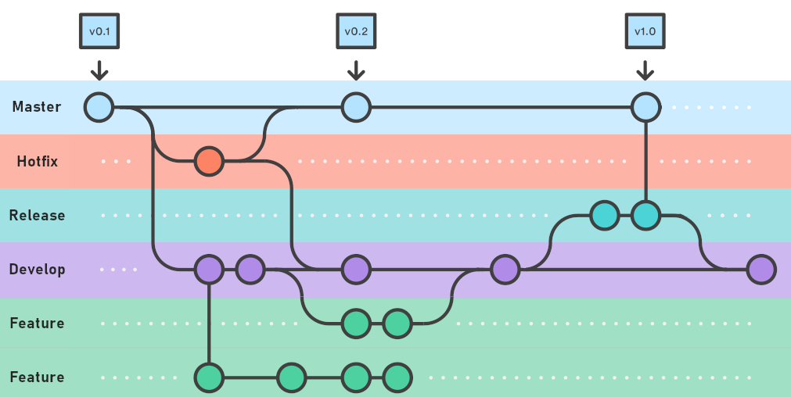

# 🛡️ Aula 03 - Git, Variáveis e Tipos de Dados

## 🎯 - Objetivos
- Apresentação Git e Github
- Criação versionamento
- PHP
  - Variáveis
  - Tipos de dados
  - Operadores
    - Precedência
    - Matemáticos
    - Lógicos

---
## Git expresso
> Git é uma ferramenta de versionamento de código. Github é um servidor em nuvem para armazenamento remoto. Para isto precisamos do Git instalado no nosso computador, uma vez instalado podemos usar a console (CLI) para executar os comandos de gerenciamento do nosso código. Muitas das IDE de desenvolvimento tem algum "plugin" para trabalhar com o Git.



- Principais comandos:

  - **Iniciar o projeto** -> Para iniciar o projeto, devemos estar na pasta onde criaremos nosso código e executar o comando `git init`. Isto vai inicializar o controle do Git na pasta selecionada, será criada uma pasta `.git` com os arquivos de configuração e controle do git. Não devemos mexer nesta pasta.

  - **Verificar o status do projeto** -> O comando que nos mostra o status do nosso desenvolvimento é o `git status`. Isto nos mostra os arquivos que ainda não estão rastreados pelo nosso `git` ou "trackeados". Teremos por exemplo a saída abaixo:

    ```bash
    PS C:\Users\emerson\Documents\tin-uc13> git status
    On branch aula-03
    Untracked files:
      (use "git add <file>..." to include in what will be committed)
            aula-03/
    
    nothing added to commit but untracked files present (use "git add" to track)
    PS C:\Users\emerson\Documents\tin-uc13> 
    ```
  - **Adicionar arquivos ao projeto** -> Para que nossos arquivos sejam então rastreados pelo `git` devemos adicioná-los ao projeto executando o comando `git add .<nome do arquivo>` ou se forem muitos arquivos podemos simplesmente executar `git add .`.
  - **Aplicar alterações no projeto** -> Para que possamos "gravar" os arquivos alterados no projeto, precisamos executar o processo de "**commit**". Para isto executamos o comando `git commit -a -m "Mensagem sobre as alterações"`, com este comando executamos o processo de gravar todas as alterações (opção **-a**) e aplicado a mensagem (opção **-m**) referente as alterações executas.
  - **Cria nova Branch** -> Sempre que vamos criar um novo desenvolvimento devemos criar uma nova branch a fim de evitar modificações antes de finalizado o código do novo desenvolvimento. Para isto usamos o comando `git checkout -b "testes"`, isto vai criar uma nova branch chamada testes e estaremos desenvolvendo nesta branch sem impactar no código que está funcional ma **main**.
  - **Enviar o código local para Github** -> Sempre que queremos sincronizar nosso desenvolvimento local para o servidor internet do Github deve executar um *push* deste código. Assim usamos o comando `git push` caso a branch já exista, caso não exista a branch no servidor remoto devemos executar o comando `git push --set-upstream origin <nome da branch>` isto vai criar a branch no Github e subir nosso código.
  - **Atualizar repositório local com remoto** -> Usamos o comando `git pull`. Devemos ficar atentos com a branch que estamos "posicionados". Para isto podemos usar o comando `git status`.
  - **Remover arquivos** -> Caso tenhamos criado algum arquivo no nosso repo local que não deve ir para o código oficial e ele se encontre como *untracked* podemos usar o comando `git clean -f`.
  - **Remover modificações** -> Caso desejemos remover as modificações realizadas em um arquivo que não foi atualizado na branch, usamos o comando `git checkout <.\nome_do_arquivo>`.
  - **Verificar modificações no Repo** -> Usamos o comando `git log` para mostrar todas as alterações no projeto.


## Variáveis
> Para declarar uma variável em PHP usamos o simbolo *$* antes do nome da variável. Os nomes de variáveis no PHP são *case sensitive*. Nomes válidos são iniciados com letras (A-Z, a-z) ou _ seguidos de qualquer número de letras, números ou sublinhados.

- Escopo
  - Global
  - Local
  - Uso da palavra-chave **global**
- Estáticas
- Externas

- [Variáveis](https://www.php.net/manual/pt_BR/language.variables.php)

---
## Tipos de dados
> O PHP possui tipagem dinâmica, ou seja, não há necessidade de especificar o tipo de dado de uma variável pois ele é determinado automaticamente em tempo de execução. Podemos determinar apenas a declaração de tipo para parâmetro de funções, valores de retorno e propriedades de classes.

- `Parâmetro de funções`
```php
function soma(int $a, int $b): int {
  return $a + $b;
}

echo soma(5,10);
```

- `Propriedade de classe`
```php
class Pessoa {
    public string $nome;
    public int $idade;
}

$pessoa = new Pessoa();
$pessoa->nome = "João";
$pessoa->idade = 30;
```

- `Constante de classe`
```php
class Config {
    public const int MAX_USUARIOS = 100;
}

echo Config::MAX_USUARIOS; // Saída: 100
```

- [Tipos](https://www.php.net/manual/pt_BR/language.types.php)

---
## Material Extra
- [Documentação do PHP](https://www.php.net/manual/pt_BR/index.php)